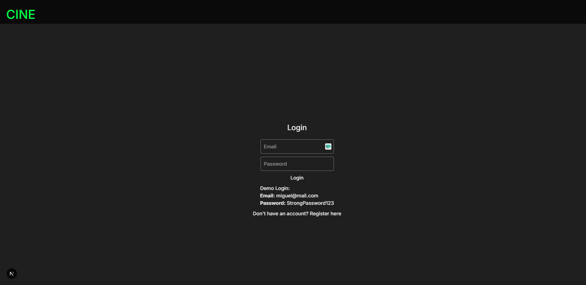
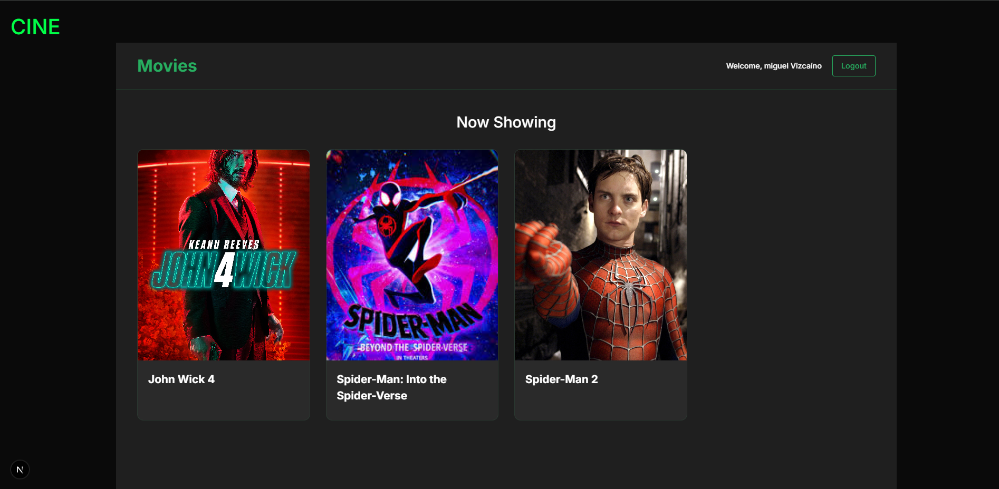
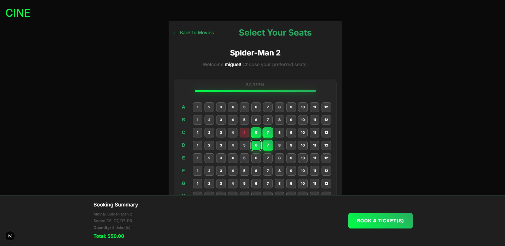

# 🎬 Sistema de Reservas de Entradas de Cine

Este sistema permite a los usuarios visualizar películas, seleccionar asientos y reservar entradas de cine. Está compuesto por un backend robusto en Java y Spring Boot, junto a un frontend moderno con Next.js y React. Todo el backend está estructurado bajo principios de **Arquitectura Hexagonal**, **Clean Architecture** y **DDD (Domain-Driven Design)**.

---

## 📁 Estructura del Proyecto

```
cine/
├── backend-spring/ # Backend en Java + Spring Boot
├── frontend/ # Frontend en Next.js + React + TypeScript
└── figures/ # Imágenes y diagramas del sistema
```


---

## 🔧 Tecnologías Usadas

| Capa       | Tecnología                        |
|------------|-----------------------------------|
| Backend    | Java 21, Spring Boot 3+, JPA      |
| Persistencia | Hibernate, PostgreSQL / H2     |
| Frontend   | React, Next.js, TypeScript        |
| ORM        | Spring Data JPA                   |
| Estilos    | CSS Modules                       |
| Autenticación | Básica (expansible a JWT/OAuth2) |

---

---

## 🖼️ Capturas de la Interfaz

### 🔐 Login



---

### 🎞️ Listado de Películas



---

### 🎟️ Selección de Asientos



---

## 📐 Arquitectura Hexagonal

Este proyecto sigue la **Arquitectura Hexagonal (Ports and Adapters)**, permitiendo una separación estricta entre dominio, aplicación e infraestructura. Solo los adaptadores interactúan con el mundo externo (por ejemplo, base de datos y web controllers).

### 📌 Diagrama de Arquitectura


---

## 🗃️ Modelo Entidad-Relación (ER)

El sistema maneja entidades como `User`, `Movie` y `Ticket`, organizadas de forma relacional:


---

## 🧪 Backend (Spring Boot + Java 21)

**Características:**

- Arquitectura Hexagonal
- Separación de capas:
  - `domain`: contiene los modelos, interfaces y lógica central
  - `application`: orquesta la lógica de negocio con DTOs y handlers
  - `infrastructure`: maneja la persistencia y exposición REST
- Integración con base de datos (JPA)
- Preparado para añadir autenticación JWT y tests unitarios

**Estructura destacada:**
```
backend-spring/
└── src/main/java/com/cinema/cine/
├── application/
│ ├── dto/
│ ├── factory/
│ └── handler/
├── domain/
│ ├── api/usecase/
│ ├── model/
│ └── spi/
└── infrastructure/
├── controller/
├── adapter/
├── config/
└── persistence/
├── adapter/
├── entity/
└── repository/
```


---

## 💻 Frontend (Next.js + React + TypeScript)

**Características:**

- Componentes organizados por página
- Uso de rutas dinámicas para selección de asientos
- Integración futura con el backend para persistencia real
- Estilos encapsulados con CSS Modules

**Estructura:**

```
frontend/
└── src/app/
├── login/
├── movies/
└── seats/[id]/
```


## 🚀 Cómo ejecutar

### ▶ Backend

```bash
cd backend-spring
./mvnw spring-boot:run
```

```
cd frontend
npm install
npm run dev
```
Accede a la interfaz en: http://localhost:3000


---

### ✅ Notas finales:

- Las rutas a las imágenes (`figures/*.png`) están preparadas para que funcionen correctamente en GitHub o cualquier servicio de repositorios.
- Si usas GitHub Pages para documentación, asegúrate de que las imágenes se mantengan en esa carpeta `figures/` o ajusta las rutas.
- ¿Quieres que también genere una versión en inglés, o con badges de build, coverage, versión, etc.? Puedo ayudarte con eso también.
